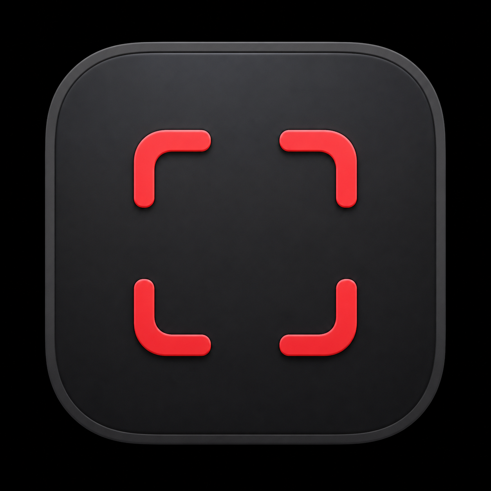
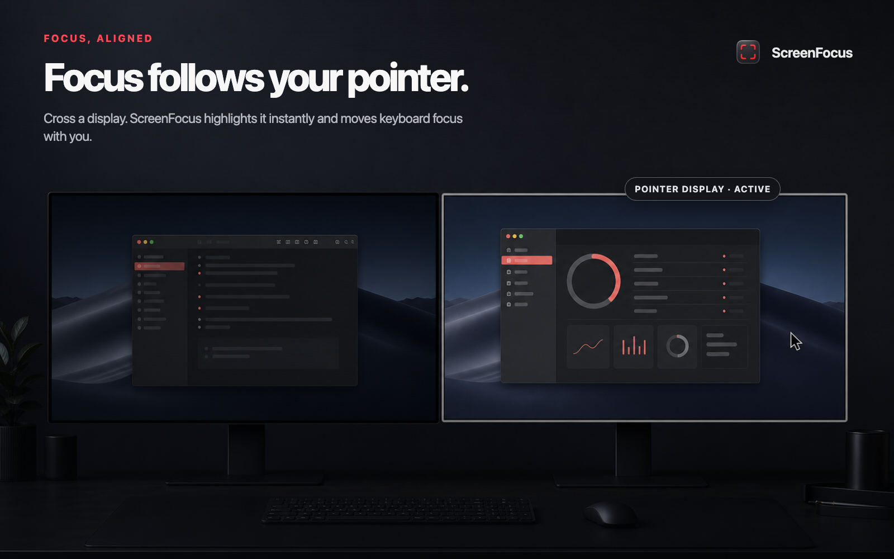
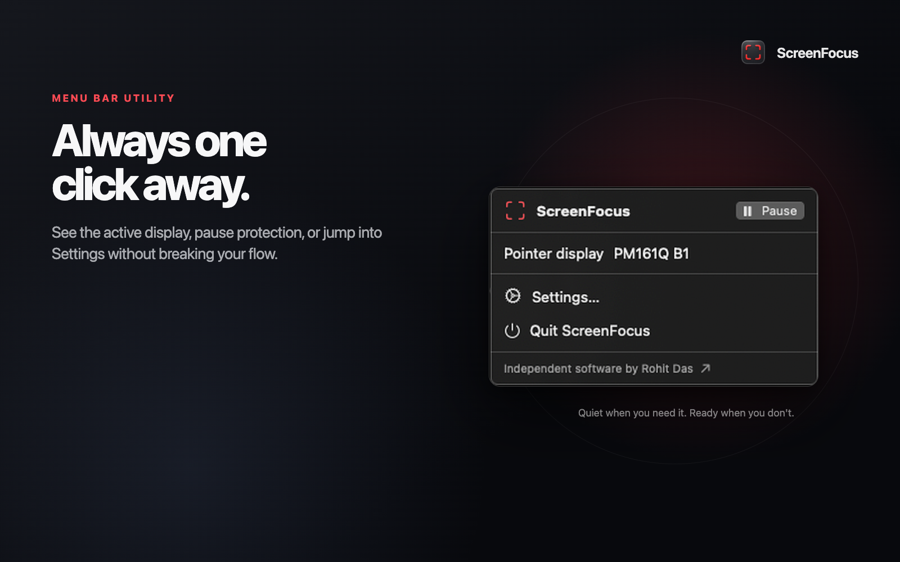
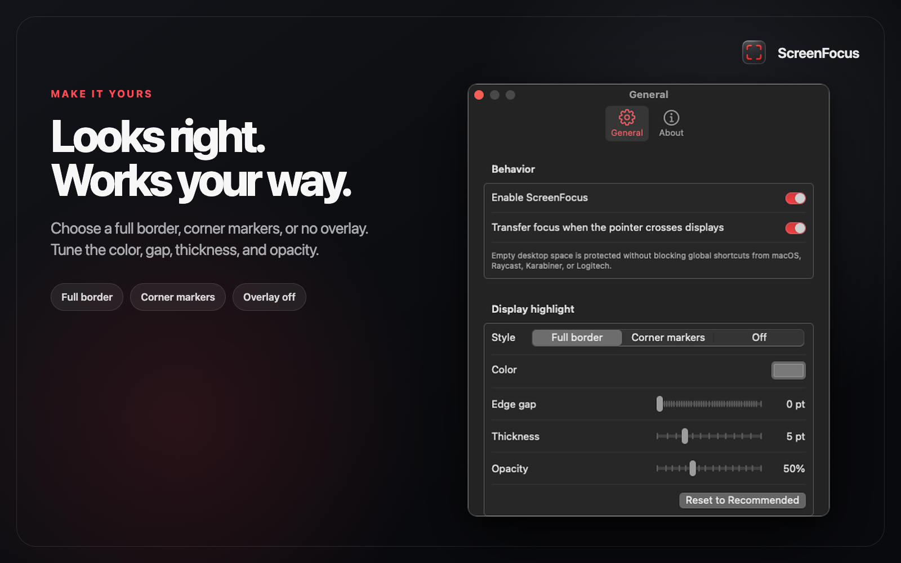
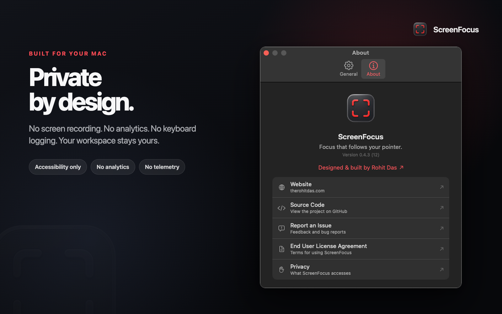

<p align="center">
  
</p>

<h1 align="center">ScreenFocus</h1>

<p align="center">
  A small native macOS utility that keeps keyboard focus aligned with the display
  containing your pointer.
</p>

<p align="center">
  <a href="https://therohitdas.com">Rohit Das</a> · macOS 14+ ·
  Apple Silicon and Intel · SwiftUI + AppKit · No analytics
</p>

---

ScreenFocus lives in the menu bar. When your pointer crosses to another display,
it immediately highlights that display and moves keyboard focus to the window
under the pointer—without requiring a click.

If there is no usable window under the pointer, ScreenFocus temporarily takes
focus itself. Ordinary typing no longer reaches a text field on the previous
display, while system-wide shortcuts from macOS, Raycast, Karabiner-Elements,
and Logitech software remain available.

## ScreenFocus in action









## Why

On macOS, moving the pointer to another display does not move keyboard focus.
That makes it easy to press a shortcut over Display 2 and accidentally run it
inside an editor that is still focused on Display 1. ScreenFocus closes that gap.

## Features

- Focuses the window under the pointer when crossing displays.
- Protects the previous text field when the new display has no target window.
- Shows an instant full-display border using your chosen color and opacity.
- Includes optional corner markers and a completely hidden overlay mode.
- Preserves global shortcuts instead of intercepting the keyboard.
- Defers focus changes while dragging.
- Handles display reconnection and rearrangement.
- Runs as a lightweight menu-bar app.
- Requires no Screen Recording or Input Monitoring permission.

## Install

### Download a release

1. Download the latest `ScreenFocus-x.y.z.zip` from
   [Releases](../../releases).
2. Unzip it and drag `ScreenFocus.app` into `/Applications`.
3. Open ScreenFocus from Applications.

This project is locally signed rather than Apple-notarized. If macOS blocks the
first launch, try opening the app once, then use:

**System Settings → Privacy & Security → Security → Open Anyway**

Apple documents this flow in
[Open a Mac app from an unknown developer](https://support.apple.com/guide/mac-help/mh40616/mac).

For a release you obtained from this repository and personally trust, the
Terminal fallback is:

```sh
xattr -dr com.apple.quarantine /Applications/ScreenFocus.app
open /Applications/ScreenFocus.app
```

That command removes macOS's downloaded-file quarantine marker. Do not use it on
an app from an untrusted source.

### Grant Accessibility access

The border works without permission, but focus transfer requires Accessibility:

1. Open the ScreenFocus menu-bar item.
2. Select **Grant Accessibility Access**.
3. In **System Settings → Privacy & Security → Accessibility**, enable
   ScreenFocus.
4. Return to ScreenFocus. Its status should change from **Highlight only** to
   **Aligned**.

ScreenFocus does not read the screen, record audio, monitor all keystrokes, or
send data over the network. See [Privacy](docs/PRIVACY.md).

## Use

1. Click a text field on one display.
2. Move the pointer over a window on another display without clicking.
3. The new display highlights immediately and its window receives keyboard
   focus.
4. Move over empty desktop space to engage the focus guard and protect the
   previous text field.

Open **Settings…** from the menu-bar item to change:

- Full border, corner markers, or no overlay.
- Highlight color.
- Edge gap, thickness, and opacity.
- Focus transfer.
- Launch at login.

For status meanings, troubleshooting, and uninstall steps, read
[Help](docs/HELP.md).

## Build from source

### Requirements

- macOS 14 or later.
- Xcode with Swift 6.2 or later.
- Xcode Command Line Tools.
- OpenSSL, included with current macOS developer environments.

```sh
git clone https://github.com/therohitdas/ScreenFocus.git
cd ScreenFocus

# One-time local signing setup. This keeps Accessibility approval stable.
./scripts/setup-local-signing.sh

# Build a Universal app for Apple Silicon and Intel.
./scripts/build-app.sh

open dist/ScreenFocus.app
```

The signing setup creates a ScreenFocus-only development certificate in your
login keychain. It does not export or commit the private key.

To create a distributable archive and SHA-256 checksum:

```sh
./scripts/package-release.sh
```

For the project structure and development workflow, see
[Development](docs/DEVELOPMENT.md).

## Test

```sh
swift test
```

Automated tests cover display-crossing behavior, settings persistence, color
parsing, overlay independence, and Settings-window behavior. Cross-application
focus still needs a short manual test because macOS does not allow a test suite
to grant Accessibility permission on a user's behalf.

## Permissions

| Permission | Needed | Why |
|---|---:|---|
| Accessibility | Yes | Find, activate, and verify the window under the pointer |
| Screen Recording | No | ScreenFocus does not capture display content |
| Input Monitoring | No | ScreenFocus does not install a global keyboard listener |
| Microphone / System Audio | No | ScreenFocus does not use audio |

## Documentation

- [Installation and Gatekeeper](docs/INSTALL.md)
- [Help and troubleshooting](docs/HELP.md)
- [Development guide](docs/DEVELOPMENT.md)
- [Privacy](docs/PRIVACY.md)
- [End User License Agreement](EULA.md)
- [Changelog](CHANGELOG.md)

## Current version

`0.4.3`

ScreenFocus is an early personal utility. Back up anything important and test
its behavior with the applications and shortcuts you rely on.
